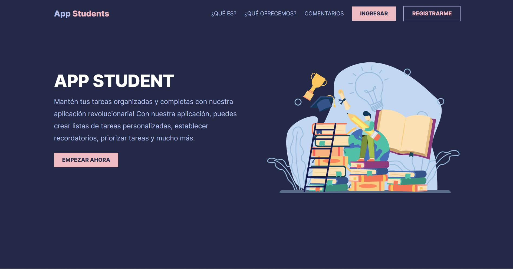

# App Student



Mantén tus tareas organizadas y completas con nuestra aplicación revolucionaria! Con nuestra aplicación, puedes crear listas de tareas personalizadas, establecer recordatorios, priorizar tareas y mucho más.

## ¿Cómo instalar el proyecto?

Como primer paso tenemos que descargar este proyecto ya sea en formato `.zip` o `clonarlo` haciendo un `git clone`, también podés hacer un `fork`, pero para este caso haremos un `git clone` de la siguiente manera:

```
  git clone https://github.com/Kevin04C/app-estudiantes.git
```

Una vez hecho eso debemos movernos a ese directorio con el comando:

```
  cd app-estudiantes
```

Una vez realizado los 2 pasos anterior lo tenemos es instalar todas las dependencias que necesita el proyecto para esto es importante tener `node` si no lo tienes puedes ir a su [página oficial](https://nodejs.org/) a descargarlo.

Una vez que ya lo hayamos descargado ejecutamos el siguiente comando:

```
  npm install
```

Ahora tenemos que configurar el `.env` de nuestra proyecto, el `.env` básicamente son variables que por defecto _no se suben a GitHub_ pero son necesarias para que el proyecto funcione, esto lo crearemos en la raiz del proyecto.

Si tienes un Sitema Operativo basado en unix puedes ejecutar el siguiente comando:

```
  touch .env
```

Dentro del archivo .env tendremos que color lo siguiente:

```
VITE_API_APP_ESTUDIANTES=YOUR_API
```

El formato del .env es similar al formato de los objetos que conocemos en JavaScript `clave` - `valor` crearemos un variable `VITE_API_APP_ESTUDIANTES` en donde asiganeremos la `URL` de nuestra API.

Si no sabes de donde sacar esta URL puedes leer el README del backend de este proyecto para obtener la URL y poder correr la aplicación [Backend del proyecto](https://github.com/repicam/app-estudiantes-backend.git).

Una vez confurado el backend del proyecto y haber obtenidor la URL del backend podemos correr el proyecto con el siguiente comando:

```
  npm run dev
```

Y ¡LISTO! ya podés probar al aplicación.
